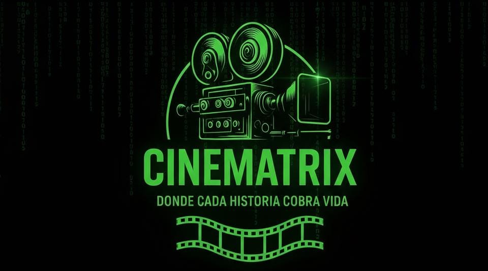

  

# 💻 Proyecto: CINEMATRIX

Este repositorio forma parte de la organización **CINE-UDEA** y fue desarrollado por estudiantes de Ingeniería Industrial como parte de un reto académico colaborativo.

---

## 👥 Integrantes del equipo

| Nombre completo                  | Usuario GitHub              | Rol en el proyecto              |
|----------------------------------|------------------------------|----------------------------------|
| Tomás Álvarez Rodríguez          | [@tomasalvarez-shadow](https://github.com/tomasalvarez-shadow) | Líder académico y técnico        |
| Angélica Paola Gómez Pacheco     | [@Angelica0511](https://github.com/Angelica0511)               | Desarrollo y documentación       |
| Luz Darys Nuñez Zapata              | [@andresnunez10](https://github.com/andresnunez10)             | académica y técnica           |
| Denisse Fabiana Hurtado          | [@denisse15](https://github.com/denisse15)                     | Diseño y presentación            |

---

## 📽️ Descripción del Proyecto

**CINEMATRIX** es una iniciativa académica desarrollada por estudiantes de Ingeniería Industrial de la Universidad de Antioquia como parte del reto integrador de la asignatura *Algoritmia y Programación 2025-2*. El proyecto simula un sistema de gestión cinematográfica dirigido a la comunidad universitaria, con énfasis en accesibilidad, diversidad cultural y experiencia inmersiva.

Diseñado para estudiantes que inician su formación en programación, CINEMATRIX se desarrolla íntegramente en **Google Colab**, utilizando **Python** como lenguaje base y aplicando principios de diseño modular, documentación pedagógica y buenas prácticas colaborativas. El sistema permite registrar películas, simular reservas, mostrar estadísticas y generar recomendaciones, todo dentro de un entorno técnico accesible y educativo.

El proyecto integra elementos de **ciberseguridad**, **automatización** y **visualización básica**, y se apoya en herramientas como **GitHub**, **Markdown** y **diagramas de Gantt** para la gestión técnica y documental. CINEMATRIX busca no solo resolver un reto algorítmico, sino también fomentar el pensamiento crítico, el trabajo en equipo y la excelencia académica en entornos colaborativos.

---

##  Objetivos del Proyecto

- Simular un sistema de gestión cinematográfica para la comunidad universitaria.  
- Aplicar principios de programación modular y documentación pedagógica.  
- Fomentar el trabajo colaborativo y el pensamiento crítico en entornos técnicos.

---

## Metodología de Trabajo

El desarrollo se realizó bajo una metodología ágil, con división de roles, revisión por pares (*pull requests*), control de cambios mediante *issues* y planificación semanal con diagrama de Gantt.

---

## 💻 Tecnologías utilizadas

- Google Colab  
- Python 3  
- Markdown  
- Git y GitHub  
- Licencia MIT / Creative Commons  
- Herramientas de planificación (diagrama de Gantt)  
- Visualización básica (matplotlib / seaborn)  
- Repositorios de GitHub consultados:  
  - Python-Examples
  - Awesome-Python
  - Simple-Python-Projects 
- Canales de Telegram utilizados:  
  - Python UdeA  
  - Algoritmia y Programación 2025-2  
  - Ciberseguridad y Programación

---

## Documentación del Proyecto

- [Especificación de Requisitos](requisitos.md)  
- [Visión del Proyecto CINEMATRIX](vision.md)  
- [Integrantes y Vínculos Académicos](Integrantes-Vínculos%20acad%C3%A9micos%20y%20descripci%C3%B3n.md)  
- [Plan de Proyecto CINEMATRIX](plan.md)

---

## 📂 Estructura del repositorio

- `/notebooks/`: Código fuente en Google Colab  
- `/documentación/`: Archivos Markdown con requisitos, visión y plan  
- `/recursos/`: Imágenes, diagramas y entregables  
- `README.md`: Página principal del proyecto  
- `LICENSE.md`: Licencia del proyecto

## 📄 Licencia

Este proyecto está bajo la Licencia MIT. Puedes consultar el archivo `LICENSE.md` para más detalles.

---

## Agradecimientos

Agradecemos al equipo docente de *Algoritmia y Programación 2025-2* por su acompañamiento, y a la comunidad **CINE-UDEA** por inspirar este proyecto académico.

<!-- actividad:start -->
<!-- actividad:end -->

  
